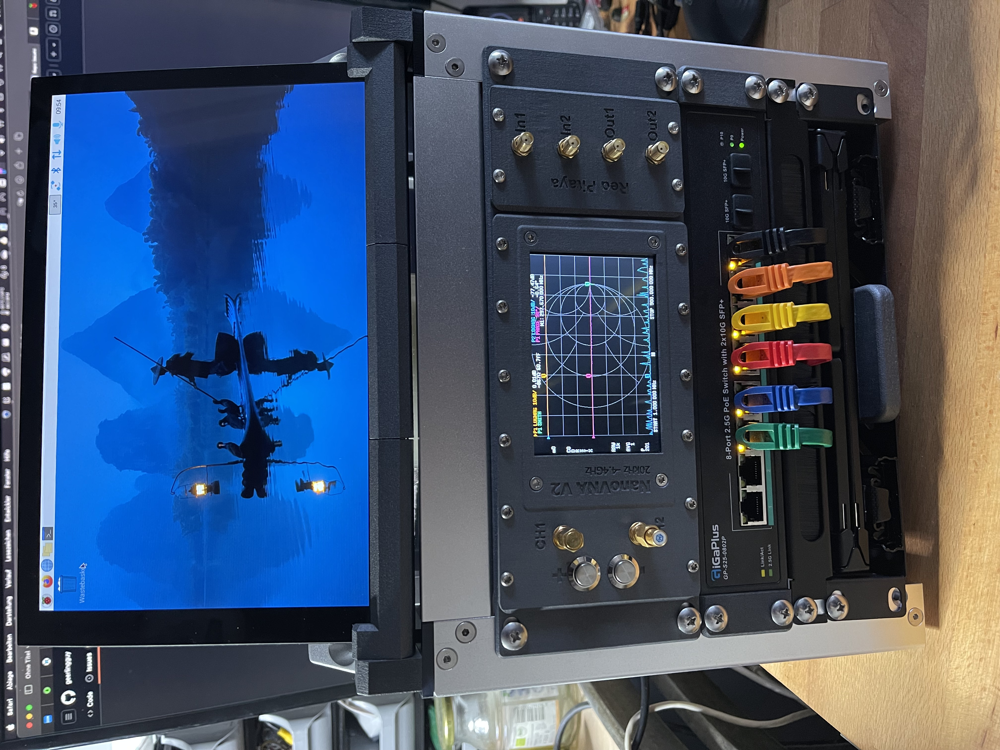
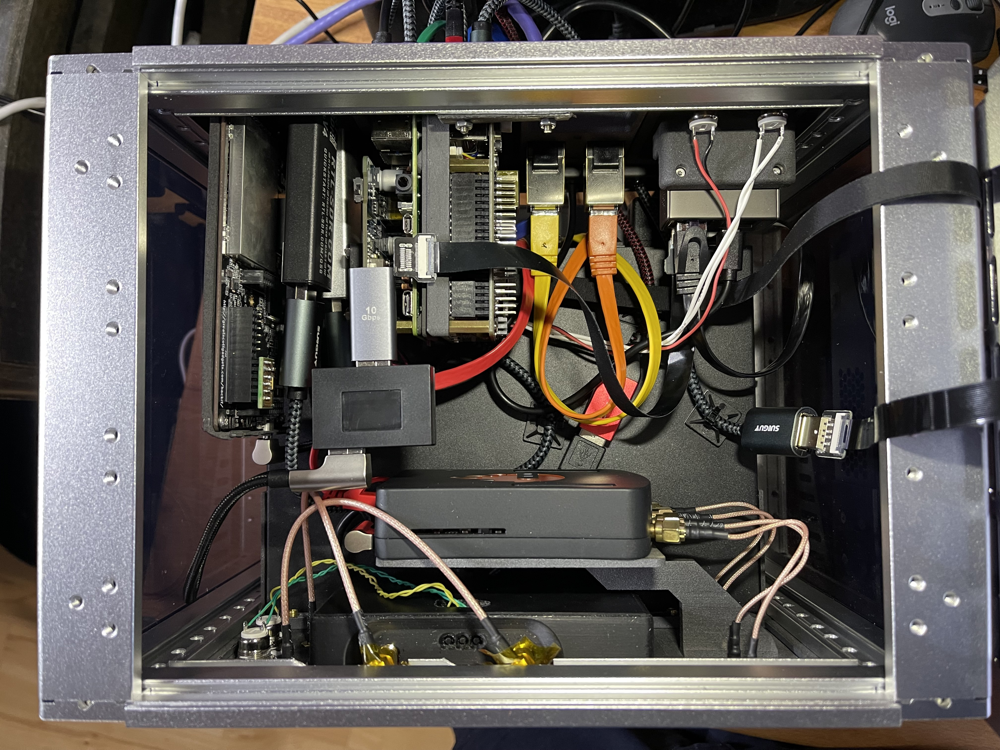
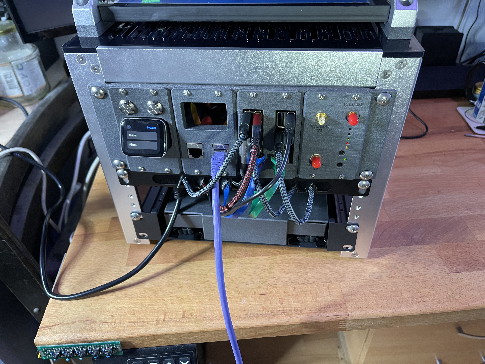
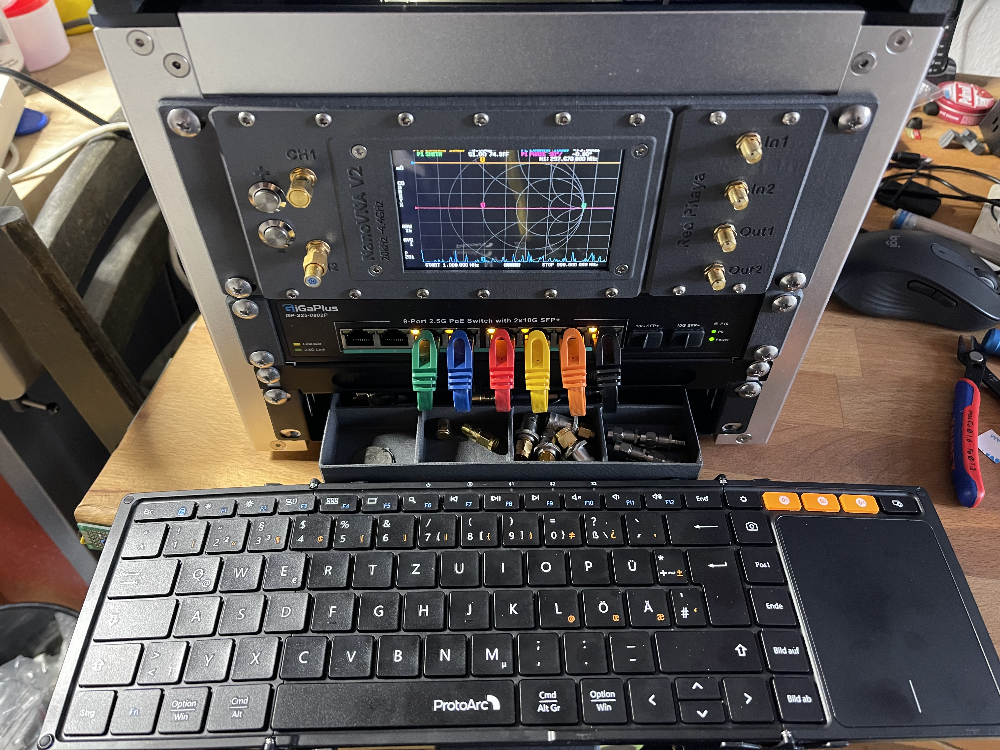
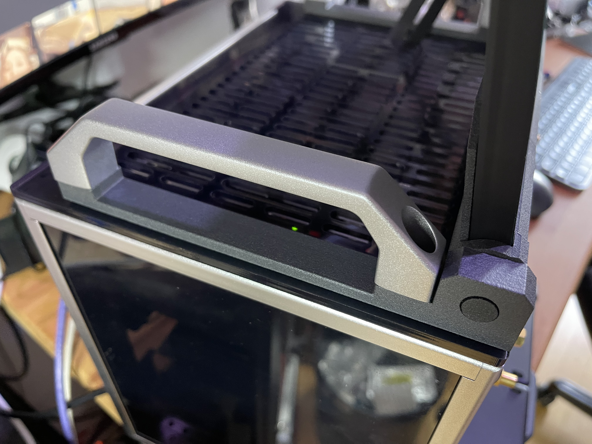

# 10inch-Rack-SDR-Station
10inch 4U Reck SDR Station with built in nanoVNA, Red Pitaya, 2x RTL-SDR and an HackRF

Inspired by Jeff Geerling’s mini-rack (https://github.com/geerlingguy/mini-rack and https://mini-rack.jeffgeerling.com),
I set out to develop one of my own. I had a lot of parts lying around, including two Raspberry Pis, a spare nanoVNA,
a Red Pitaya, two RTL-SDRs, a HackRF, and some other components.

The goal was to create a self-contained SDR station that I could take wherever I needed without the necessity
of external devices like a monitor, keyboard, or mouse. Everything is mounted in the small 4U DeskPi RackMate T0.
The only connections needed are power and, optionally, a network cable if internet access is required.

The core of the setup is a Raspberry Pi 5 alongside a Raspberry Pi 4. The Pi 5 runs Raspberry Pi OS from an NVMe drive,
while the Pi 4 runs DragonOS. For remote access, the Pi 4 is connected to a JetKVM, and for the Pi 5, I use
Raspberry Pi Connect. Additionally, you can still use VNC or SSH to access the machines.

For the brackets, I used JaredC01’s LabStack (https://github.com/JaredC01/LabStack) as a starting point and
designed a few custom modules myself in Fusion 360. I printed the parts in SLS on my Formlabs FUSE1 but they
also should be printable in FDM or SLA as well.

List of parts included in tis build: (links are for referncece only, not affiliated or anything)

+ 1x Raspberry Pi4
+ 1x Power Over Ethernet PoE HAT für Raspberry Pi 4 B (https://www.amazon.de/dp/B0928ZD7QQ)
+ 1x Raspberry Pi5
+ 1x Waveshare PCIe to M.2 Adapter with PoE Function HAT+ (https://www.amazon.de/dp/B0DNLSZ3LF)
+ 1x JetKVM
+ 1x JetKVM
+ 2x RTL-SDR (a V3 and a V4)
+ 1x HackRF
+ 1x Red Pitaya
+ 1x GeeekPi DeskPi RackMate T0 (https://www.amazon.de/dp/B0DPGZPTPP) Brackets from here (https://makerworld.com/de/models/1027857#profileId-1010363)
+ 1x 10 Port 2.5Gb PoE Switch (https://www.amazon.de/dp/B0DDB3LHPX)
+ 1x ProtoArc XK01 TP Bluetooth Keyboard (https://www.amazon.de/dp/B0D7BPDLWJ)
+ 1x ELECROW 10" 1280×800 Touchscreen Monitor (https://www.amazon.de/dp/B0BHHQLKPY)
+ 2x GeeekPi 10 Zoll 0,5U Brush Cable Manager (https://www.amazon.de/dp/B0DSJFX6XV)
+ 1 pair of 20mm Drawer slides (https://www.amazon.de/dp/B0DPGZPTPP)
+ 10x deleyCO 0,5m flat CAT7 network cable (https://www.amazon.de/dp/B08SMHN5YN)
+ 2x RJ45 Keystone Coppler Module (https://www.amazon.de/dp/B0CH31YP7P)
+ 1x Micro HDMI to HDMI Stecker FPC-Flatcable 1080P 90 Grad up 0.5m (https://www.amazon.de/dp/B0CDRYSD29)
+ 1x Micro HDMI to mini HDMI Stecker FPC-Flatcable 1080P 90 Grad down 0.2m (https://www.amazon.de/dp/B01LZN83ID)
+ 1x USB 2.0 Typ-A to Micro-USB 0.2m (https://www.amazon.de/dp/B0967TZFT1)
+ couple of other USB cables as needed, between 0.3 and 0.5m
+ lots of cable ties to keep everyting in place an neat

As for the brackets/modules i designed a few new ones:

+ Module 3x nanoVNA v2 Plus 4inch LCD
+ Module 1x Red Pitaya
+ Module 1x SDR 2x RTL 1x HackRF
+ Module 1x Keystron with passthrough, Keystron at the bottom
+ Keyboard handle
+ Magnetically fixed drawer for storage including drawer cover so nothing falls out in transport
+ Mounting Brackets for Monitor

here a shot from the inside

and from the back

with opened Keyboard

Monitor Bracket

